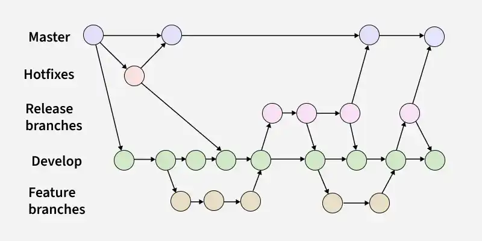

# GODOT Tips'n'Tricks
 
## Reasoning
Godot engine has multiple great tutorials & guidelines that provide ways to manage small, medium-sized & large projects, it lacks one unified base with standardized codebase rules that can make managing any project easier.

## Contents
The repository is created to:
- Enable faster & more standardized code development among multiple projects
- Share base godot's project template that can be used as a good start for any new project
- Interactively show reasons behind certain convention for dirs, scenes & scripts naming
- Provide ways for lasting & easy to refactor code that is:
  - **loosly coupled** - refactoring one module won't affect others too much
  - **compile time safe** - usage of typing & assetions make bugs occur on game's launch
  - **modular** - each module affects only it's state

### Rare _process rule
Each time you want to use _process func you need to answer 2 questions:
1. Do I need delta since last frame? Yes -> Use _process, No -> Go to step 2
2. Do I need to update state each frame? Yes -> Use _process, No -> Just rely on signals

Although using signals usually will result in additional 2-3 lines of code it can very effectively separate concerns.
Example using _process:
```
extends Node

@onready var hp_label: Label = %HPLabel
@onready var money_label: Label = %MoneyLabel

func _process(_delta: float) -> void:
    hp_label.text = str(ProcessSourceOfTruth.player_hp)
    money_label.text = str(ProcessSourceOfTruth.player_money)
```

Example using signals:
```
extends Node

@onready var hp_label: Label = %HPLabel
@onready var money_label: Label = %MoneyLabel

func _ready() -> void:
    ProcessSourceOfTruth.player_hp_changed.connect(_on_player_hp_changed)
    ProcessSourceOfTruth.player_money_changed.connect(_on_player_money_changed)

func _on_player_hp_changed(hp: int):
    hp_label.text = str(hp)

func _on_player_money_changed(money: int):
    money_label.text = str(money)
```

Although using signals added additional lines it's still preferable because:
- It's more efficient to use set value only when it's changed rather than 60 times per second even if no change happened.
- It's easier to track specific callbacks - we clearly se what happens on certain signal emit & we can easily modify that single func rather than modifying whole _process func.


### Branching
It should follow GitFlow Workflow rules.


There should be 2 static branches that is:
- **main** - official builds are created from here. All the code that lands on this branch should be well tested & production ready.
- **develop** - main development branch. That's the only (aside from hotfixes) branch that can be merged into main.

For any feature development there should be a branch created basing on **develop** branch.
For production updates there should be **release** branch created that has to be tested & approved before actual release.


### Dynamic scene instantiation
Each scene that needs to be dynamically added should offer _static func new\_instance()_ in it's script that's return type should be it's class_name. All the scenes that need to be instantiated inside _new\_instance()_ should be stored in Scenes Resource.
Example:
```
class_name Main extends Node

static func new_instance() -> Main:
    var main: Main = GameManager.scenes.MAIN_SCENE.instantiate()
    # Any value assignments go here
    return main
```
That way we get strong typing everywhere we need instantiate some scene.

### Data-driven design
Nodes shouldn't (in most cases) rely on each other when it comes to data. Instead they should subscribe to values of a separate Resource which works as [SSOT](https://www.getguru.com/reference/single-source-of-truth). That way nodes are independent of each other and can be easily detached or attached to node tree. 

### Folders
Each scene + script should be moved into separate folder.
Purpose of preexisting folders:
- **assets** - stores all images, fonts, shaders, models, music, sfxes & all other posible assets that are not directly included in node tree & aren't custom Resources
- **const_data** - stores custom Resources that are supposed to be set once before game start & never further changed.
- **dev** - stores artifacts of dev mode like screenshots, recordings, etc.
- **src** - stores managers, utils, scenes & scenes' data. Folders inside _src_ should follow fetaure-based approach.
- **tests** - stores tests for scenes & scripts.
 
### Saves
Saves should be created using custom Resource class containing all the info that needs to be saved.

### UI Data
Data for complex UI elements like menues, maps, tables, etc. should be stored in a specialized Resource with _\_data_ suffix. There should be only one instance of such data component stored in filesystem and that file should be used as a single source of truth for whole node tree that needs that data.

Resources get autodestructed when no node reads from them so each time new interface is created fresh state is produced.

### Stateful Types
For each simple type like int, string, etc. there is a wrapper class that make them stateful - other nodes can subscribe to it's _changed(data)_ signal. It should be used everywhere where reactivity is needed eg. UIs.

### Formatter
Formatter should be used while developing any Godot project in order to assert good code standard.
